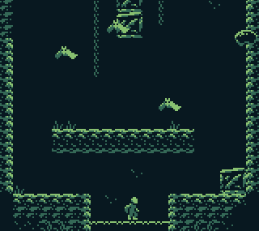

# Upwell

Upwell is a GameBoy game developed as an entry for the **ZGBJam 2018**, made using ZGB engine.
As you may notice the game is a humble love letter to Moppin's Downwell.

 

## Controls

* D-pad: movement
* Button A: Jump/Shoot

The theme of the jam was **bounce**.  You can check the [original entry here](https://tatos.itch.io/upwell).